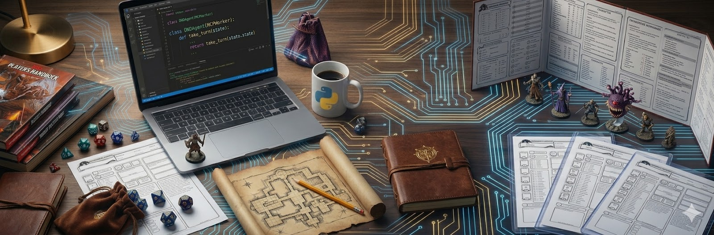

<div align="center">



<h2>⚔️ Agentic Adventuring ⚔️</h2>
</div>

For those who know tabletop roleplaying games like Dungeons and Dragons, folks know the Game Master (GM) is a multi-faceted role, being able to weave a world, manage NPCs, and know the rules. How does this relate to AI? In a world where agents must coordinate information, and respond to dynamic requests, let's go on an agentic adventure and explore how we can build multi-agentic workflows for Dungeons and Dragons! Leave this workshop gaining familiarity with building agents and MCP servers, and using A2A. This is a hands-on development workshop and will primarily use Python. This is a Beginner level workshop. No experience with agents is required.

# Setup

To follow along in this workshop, you'll need to have at least Python 3.13 installed. You'll also need `uv` installed. 
To install `uv`, following the instructions at https://docs.astral.sh/uv/getting-started/installation/.

If you don't have Python installed, you can install it with `uv`:
```
$ uv python install --default
```

Once you have `uv` and Python installed, clone the repo, setup the dependencies, and source the virtual environment.
```
$ git clone https://github.com/ecobee-jasonhadi/agentic-adventure.git
$ uv sync
$ source .venv/bin/activate
```

The API key used to authenticate for this workshop will be provided during the workshop.

# Workshop Agenda

In this workshop, we'll be covering a few points:

1. What's a tabletop role playing game and how does it relate to Agentic Systems?
2. Building our first agent.
3. What's a tool? Building our first tools and MCPs.
4. What is A2A? Building our first multi-agent flows.
5. What is RAG? Adding specialized knowledge to our agents.
6. Bringing it all together - roll for initiative!

This workshop will be a live coding workshop. I'll be typing out code live and pushing to a branch continously. If you get stuck or fall behind, pull the branch and you'll be caught up!
After each section, we'll take a few minutes for everyone to catch up and answer any questions or have some discussion.

# References

* [Original workshop inspiration](https://github.com/aws-samples/sample-once-upon-agentic-ai) 
* [Strands SDK Documentation](https://strandsagents.com/)