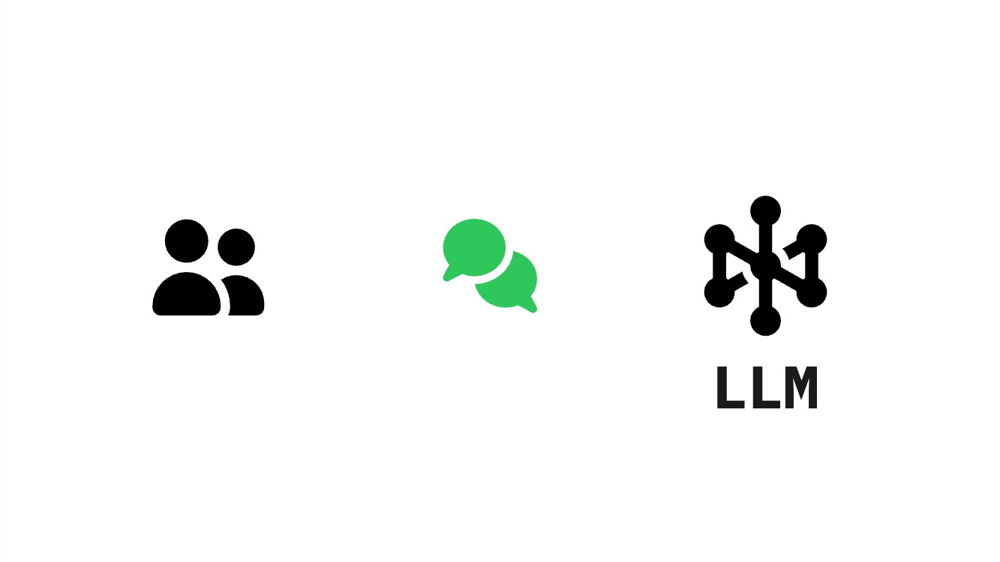
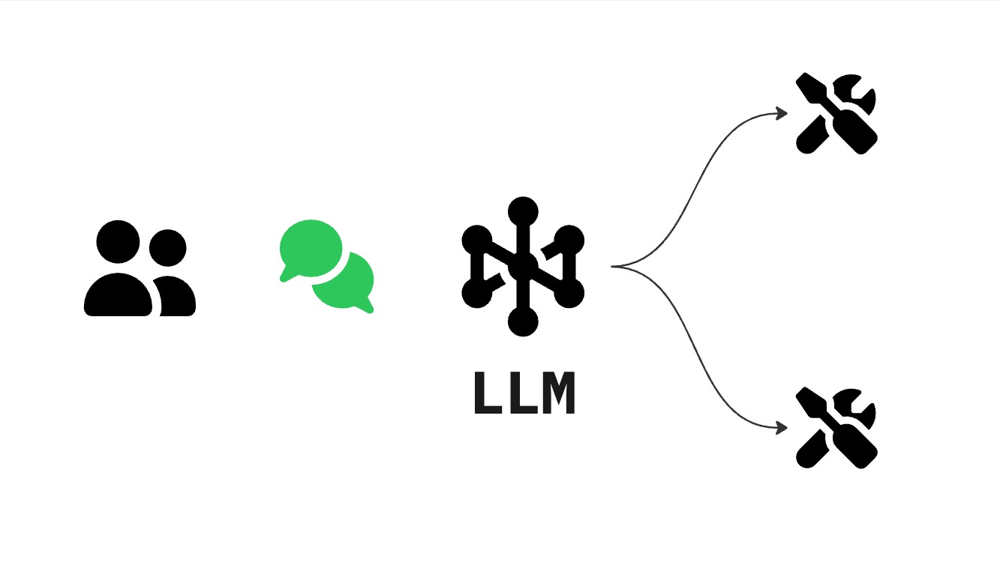
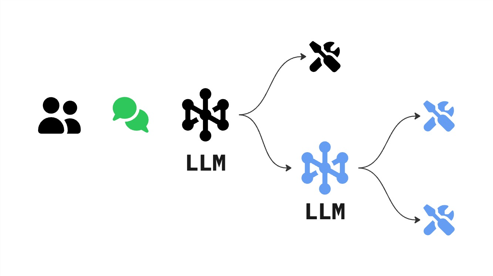
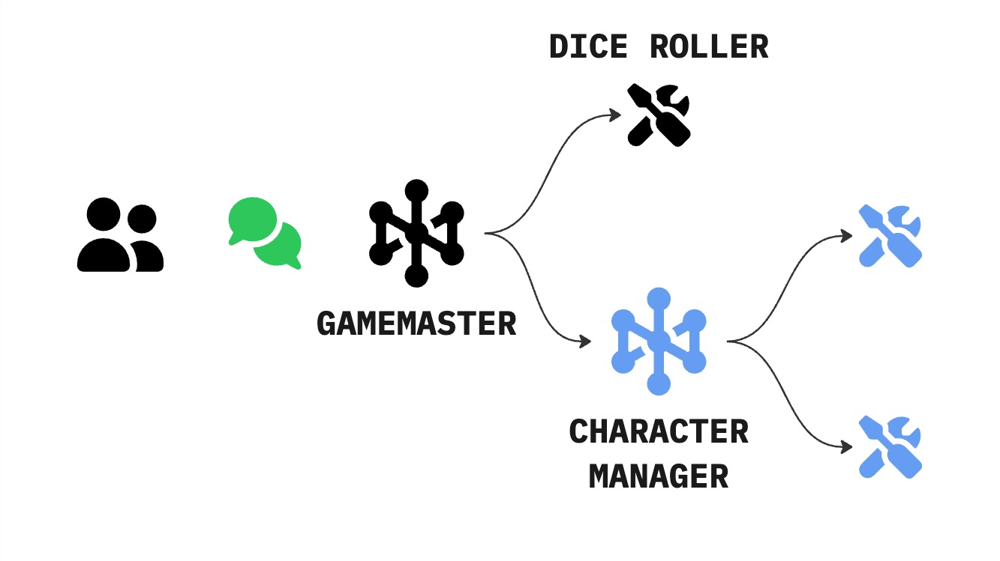
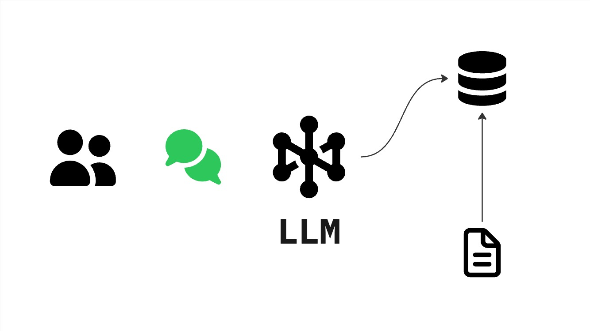
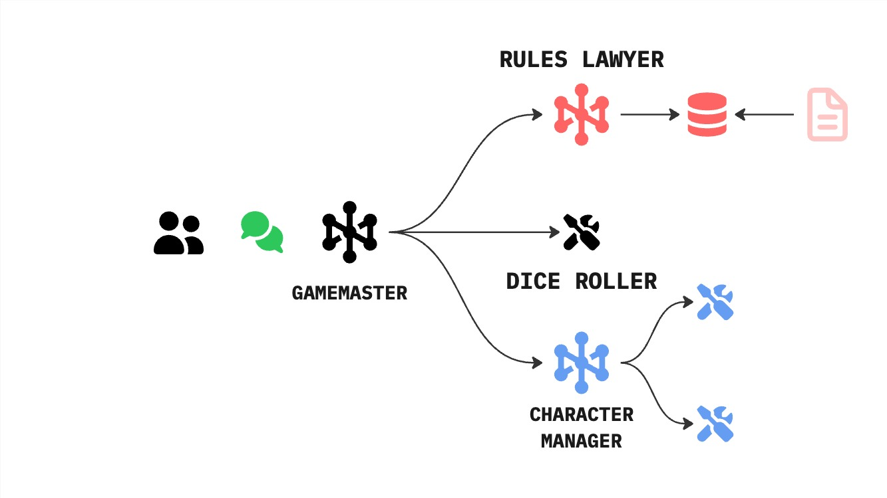

# ⚔️ Agentic Adventuring ⚔️

---

## What is a TTRPG? 🎲

- **Tabletop Roleplaying Game**
- Collaborative storytelling
- Players take on roles of characters
- Success/Failure determined by dice and rules
- **Dungeons & Dragons (D&D)**: The world's most popular TTRPG

---

## The Players 👥

- **The Players**: Control individual heroes (The Party)
- **The Game Master (GM)**: 
  - Narrates the world
  - Manages Non-Player Characters (NPCs)
  - Arbitrates the rules
  - The "Orchestrator" of the adventure

---

## TTRPGs & Agentic Systems 🤖

| TTRPG Role | Agentic System Component |
| :--- | :--- |
| **Game Master** | **Orchestrator / Agent** |
| **The Party** | **Multi-Agent Workflow** |
| **Rulebooks** | **Knowledge Base / RAG** |
| **Character Sheet** | **State / Memory** |

---

## LLM vs. Agent 🧠 vs 🏗️

- **LLM (The Brain)**: 
  - Predicts the next token
  - Passive knowledge
  - Needs a "prompt" to think
- **Agent (The Actor)**:
  - LLM + Loop + Tools
  - Goal-oriented
  - Can take actions in the world

---

---

## What's a Tool? ⚔️

- In D&D: A sword, a spell, or a lockpick
- In Agents: **Capabilities**
  - Search the web
  - Query a database
  - Calculate a value
  - Call an API

---

---

## What is MCP? 🔌

- **Model Context Protocol**
- An open standard for connecting AI models to data/tools
- Like a "Universal Adapter" for agents
- Allows the same tool to work across different platforms (Claude Desktop, IDEs, etc.)

---

## Subagents & Delegation 🤝

- One agent can call another agent!
- **Specialization**: Each agent has a specific task and tools
- **Efficiency**: Keeps the main agent focused
- **Recursive Reasoning**: Complex problems broken down
- **The Party**: A team of specialists working together

---

---

## What is A2A? 🗣️

- **Agent-to-Agent** communication
- Agents talking to other agents
- **"The Party Strategy"**:
  - One agent handles the rules (Rules Agent)
  - One agent handles the narrative (Narrative Agent)
  - They collaborate to achieve a goal

---

---

## What is RAG? 📚

- **Retrieval-Augmented Generation**
- Giving agents a "Library" to consult
- **Process**:
  1. **Retrieve**: Find relevant snippets from a document
  2. **Augment**: Add those snippets to the LLM's prompt
  3. **Generate**: Answer using the provided context
- Like a Game Master looking up a specific rule in the rulebook!

---

---

---